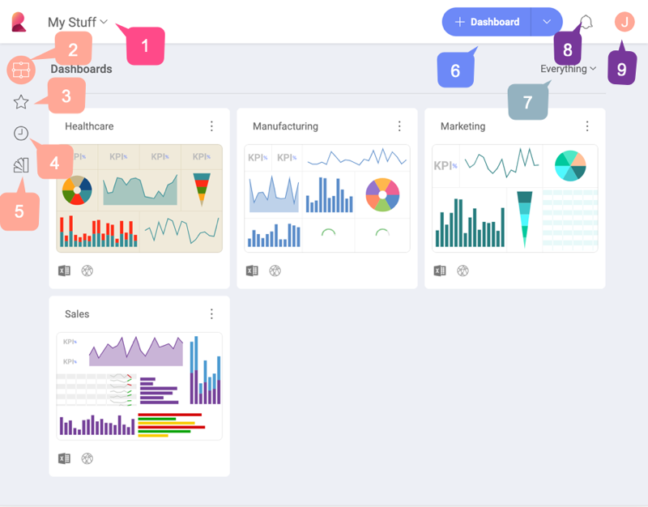

## Overview

Reveal is a self-service, cross-platform business intelligence tool that puts the power in your hands to do dashboard reporting - all without the
need for custom programming. With Reveal you can quickly create and edit dashboards, easily query and filter enterprise data sources, build meaningful visualization over data and effortlessly share your work with others whether or not they are existing Reveal users.

### General Navigation

When you first open Reveal, you will be greeted by the following screen:

Below you will find the menus on the initial Reveal screen and what you are able to do there.

1.  **My Stuff/Teams menu** - In this popover menu, you can access your personal space and any team you are a member of. You can also create new teams or join existing ones.

2.  **Dashboards module** - The dashboards     module provides you with a space where you can create, save and edit your dashboards. Teams
also have a dashboards space.

  To open the content of a dashboard, you just need to click/tap on it. Select the overflow button in the top right-hand corner of a
  dashboard to **access advance dashboard actions** such as editing, sharing or deleting.

3.  **Favorite dashboards** - Your most important dashboards are always close at hand in the *Favorites* module.

4.  **Recent module** - In the *Recent* module you will find the dashboards you have viewed or edited, sorted by the most recently used.

5.  **Dashboard samples** - In the *Samples* module you will find dashboards composed by the Reveal’s team. Take advantage of their rich variety of visualizations and edit them to create dashboards tailored to your business needs.

6.  **+ Dashboard split button** - You can start creating a new dashboard by selecting the *+ Dashboard* split button.

  Clicking/tapping the arrow of the same button opens a dropdown menu providing two options:

    - *Upload* a Reveal dashboard (an .rdash file).

    - Create a new *Folder* in your personal space or in the team you
        are currently in.

7.  **Dashboards module filter** - choose from the dropdown menu which dashboards to see in the dashboard module: all, only created by you
or shared with you.

8.  **Notifications center** - Select the the bell icon to view any team or dashboard updates.

9.  **Profile settings** - Select the icon with your initial (photo) to access Reveal’s *general settings*, *learning tips*, *Help center* and *give feedback* or ask any questions related to the application.

### Portrait Orientation for Mobile Devices

This orientation is by far the most intuitive and natural when using an iPad, an iPhone, or Android phones and tablets. When you rotate your device, all Reveal screens adapt to the new orientation.
