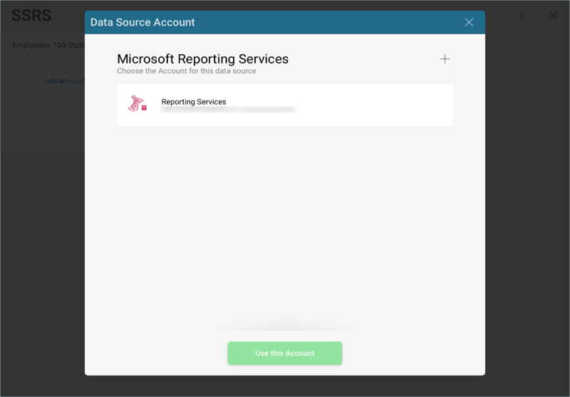

## Data Sources

As listed in the [features](~/en/general/feature-matrix.md) section, Reveal provides you with the opportunity to connect to different enterprise data sources to retrieve information. While there are no changes to be made on the server side, you will need to configure the Data Sources within Reveal to access the data. You can choose from any of the following options:

* **Analytics tools** [Google Analytics](google-analytics.md).
* *Content Managers* and *Cloud Services* ([Box](box.md), [Dropbox](dropbox.md),  [Google Drive](google-drive.md),  [OneDrive](onedrive.md) and [SharePoint Online](sharepoint.md)).
* *Customer Relationship Managers* ([Microsoft Dynamics CRM](microsoft-dynamics-crm.md) On-Premises and Online)
* *Databases* ([Microsoft SQL Server](microsoft-sql-server.md),  [Microsoft Analysis Services Server](configuring-microsoft-analysis-services.md),  MySQL[MySQL](mysql.md), [PostgreSQL](postgresql.md), [Oracle](oracle.md), [Sybase](sybase.md)) [*](~/en/general/feature-matrix.html#databases-web)
* *Other Data Sources* ([OData-Feed](odatafeed.md), [Web-Resource](web-resource.md), [JSON files](working-with-json-files.md))

> [!NOTE]
> The current Reveal release lets you create content manager data sources _only_. Analytics tools, Customer Relationship Managers and Databases are supported for dashboards imported with those data sources.

### Entering your Credentials

If you open an existing dashboard and have not yet added the Data Source credentials, you will see a message similar to the following one:

When you select any of the data sources, you will see a new dialog pop up prompting you to enter details for your data source. You will see one of two screens:

1. When using a web-based cloud, you will see a **web login** dialog.
2. When using any other provider, you will be prompted to **add an account**.

### Adding an Account

If you add a data source which is not web-based, you will see the following dialog:

You can either enter new credentials for your data source, select the "No Account" option (data sources which do not require authentication), or select an existing one if applicable. To create a new account, select the + button in the top-right hand corner.

You can configure the following details:

* *Default name* of the data source: Your data source name will be displayed in the list of accounts in the previous dialog. Reveal names it after the data source type by default. You can edit it by selecting the *pencil* icon.
* _(Optional)_ *Domain*: the name of the domain, if applicable.
* *Username*: the user account for the data source.
* *Password*: the password for the data source.

Once ready, select *Create Account*. You can verify whether the account is reaching the data source or not by selecting _Test Connection_. Then, select *Done*. You will then be able to see your dashboard displayed in Reveal.

