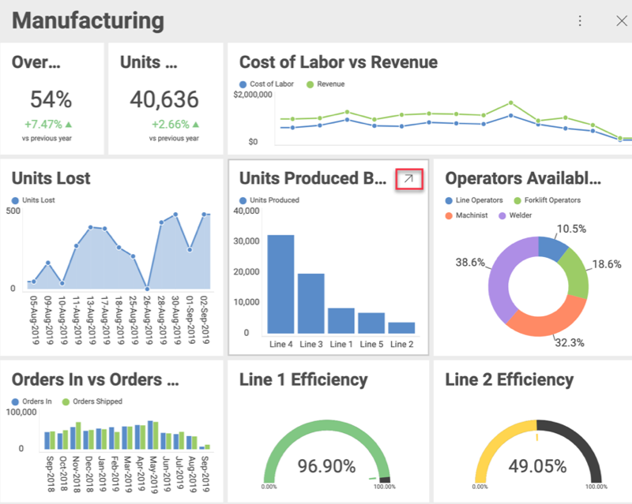
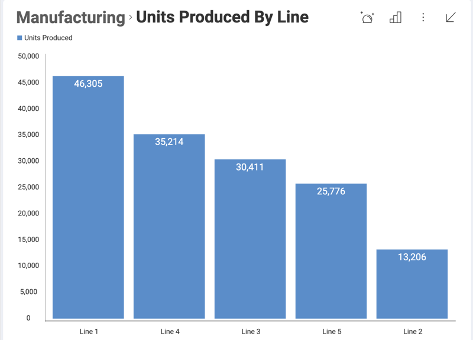
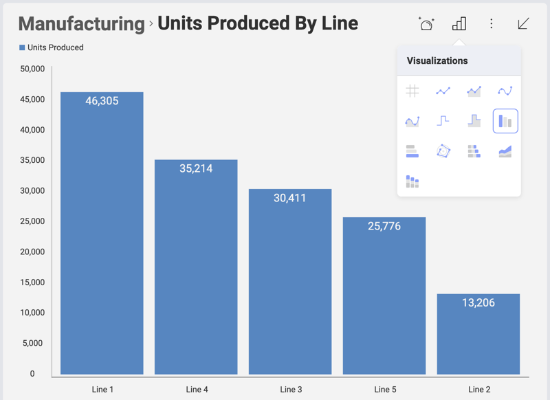
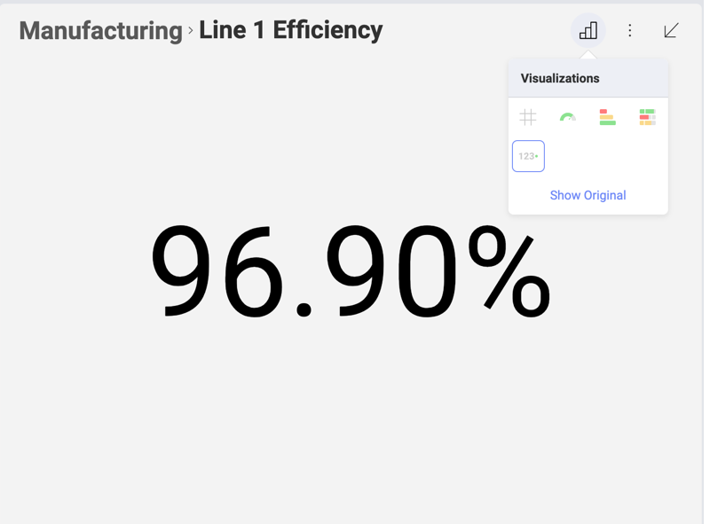
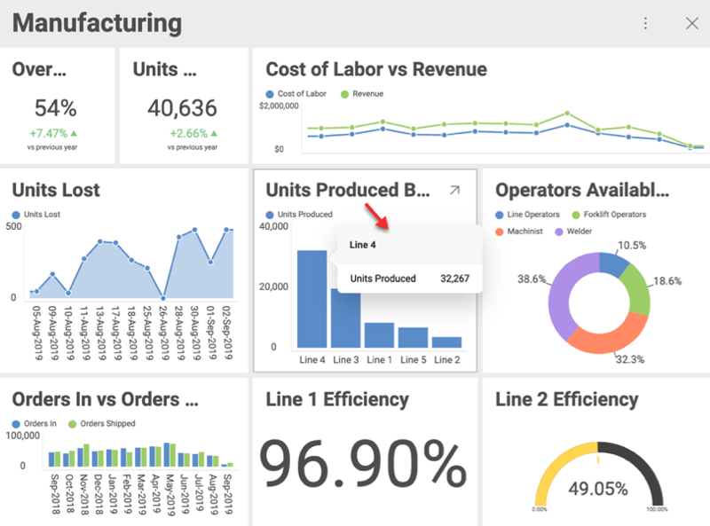
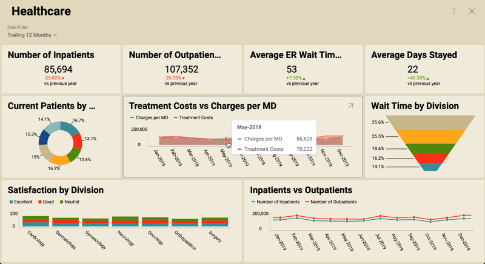
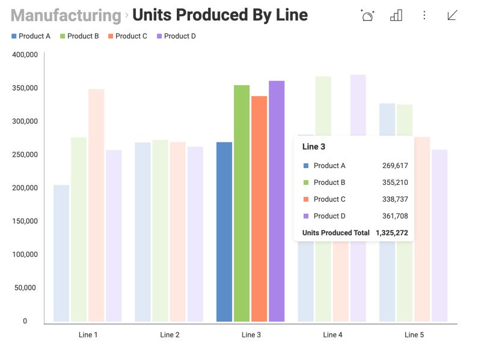
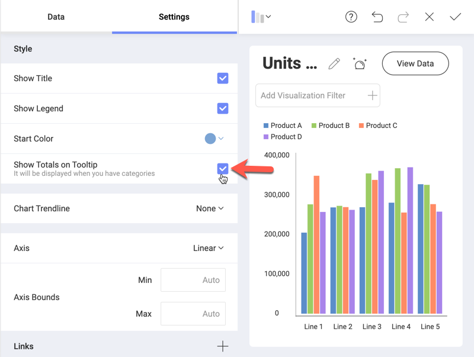
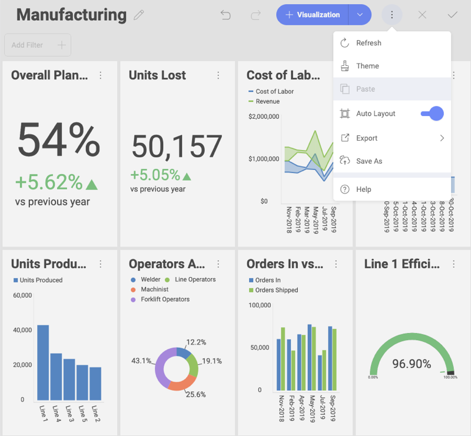

## Dashboards Overview

You can open existing dashboards by selecting the dashboard thumbnail image in the initial view.

### Dashboard Interactions

You can **interact** with visualizations in various ways. For instance, if the visualization is in grid view, you can scroll horizontally and
vertically. The chart view supports zooming and panning. Also drill down & drill up actions become possible if the underlying data model supports it.

#### Maximized view

Once the dashboard is opened, you can **maximize** any of the dashboard visualizations by hovering over them and click/tap on the arrow in the right top corner.

The maximized view allows a larger display of the information.

In this mode, you can also switch the maximized view to other visualizations by selecting the **small chart icon** in the top right corner. Different possibilities will be displayed depending on the starting visualization. The changes to the visualization will not be saved, unless you enter Edit mode (by selecting *Edit* from the overflow menu) and explicitly save the changes. 

You can also look at the data behind your chart if you select the **hash sign** icon.

When viewing the data behind your visualization, you can apply sorting (ascending or descending). For more information on applying sorting to grids, check the [Grid View](~/en/data-visualizations/grid-view.md) topic.

If, at any point, you want to revert back to the original visualization, you can select the **"Show Original"** link.

#### Regular Tooltips

By clicking on particular visualizations (press and hold in touch environments), you can see tooltips popups. Tooltips help you see values
at a particular point of your chart like:

To close regular tooltips just click or tap away.

#### Hover Tooltips & Crosshairs

In the **Interactions** menu you can enable two options: *Hover tooltips* and *Crosshairs*. Both are only available in Dashboard View mode. They can't be used in Dashboard Edit mode.

  - With *Hover Tooltips* enabled, you can see **tooltips** popups when you hover over data (press and hold in touch environments).

    

    By clicking the data (releasing drag tooltips in touch
    environments), you can access the **Tools** section with tooltip
    interactions like drill down, drill up, or linked dashboards if
    applicable.

  - With *Crosshairs* enabled, Reveal shows crosshairs elements along
    with the tooltips. Giving more context to the tooltip.

    

Crosshairs are currently supported for the following data
visualizations: Scatter, Bubble, Area, Candlestick, Line, Ohlc, Spline,
SplineArea, StepArea, StepLine.

Candlestick and OHLC visualizations only display horizontal crosshairs.
Including a vertical crosshair would make it difficult to see the lines
on the data point.

#### Tooltips Totals

When displaying tooltips, you can configure them to display total values by Category.

To enable this feature, go to *Settings* \> *Show Totals on Tooltip*,
like shown below:

When enabling totals, make sure you added a Category to show multiple
values in your visualization.

### View & Edit Modes

When first opening a dashboard, you will be browsing it in **View
mode**. This mode allows you to navigate and filter the information
displayed in it, but you won't be able to change the dashboard
definition.

In order to apply changes to a dashboard, you must switch to **Dashboard
Edit mode**. You can do this by selecting *Edit* from the overflow menu
in the top right corner of the dashboard. This enables editing options
such as applying *Auto Layout*, a dashboard *Theme* or exporting the
dashboard.

Shown below is a dashboard in *Dashboard Edit* mode:

To **exit *Edit mode***, you only need to select the *tick icon* in the
top right-hand corner. This switches back to *View Mode*.

### Dashboard Filters

It is possible to filter information at a dashboard or a visualization
level.

  - [**Dashboard filters**](~/en/filters/dashboard-filters.md) are available, when you open Dashboard Edit mode (select *Edit* from the overflow menu of your dashboard to access this mode). In the left top corner of the screen, you will see the current dashboard filters and an option to add new ones.

  - [**Visualization filters**](~/en/filters/Visualization-Filters.md) (a.k.a. Quick Filters) are displayed in maximized mode. You can find them in the top section of the visualization under the visualization's name.

For more information on dashboard or visualization Filters, check out
[this section](~/en/filters/overview.md).

### Auto Layout for Visualizations

Reveal's Auto Layout dynamically sizes all visualizations in your
dashboard based on the size constraints of your device and on the amount
of visualizations it has.

You can still resize visualizations while Auto Layout is enabled by
dragging their corners downwards or the side.
