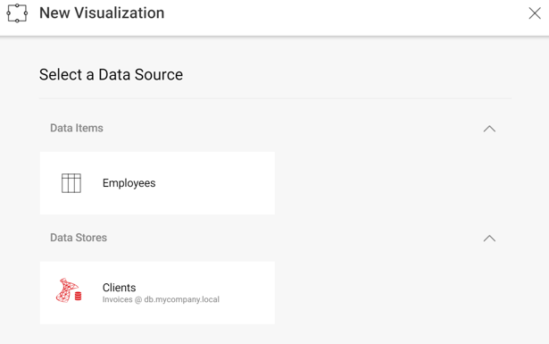

## Creating New Visualizations and Dashboards

### Overview

As described in [**Editing & Saving Dashboards**](editing-saving-dashboards-desktop.md), there are two ways to handle how you save changes to dashboards: **client-side and server-side**. Those scenarios work fine when users make minor changes to existing dashboards such as:

  - Adding/modifying filters
  - Changing the type of visualization (chart, gauge, grid, etc.)
  - Changing the theme

However, to add new visualizations the user needs to **select the data source** to be used. To do that, the containing application needs to provide information to the SDK, so it can display the list of data sources available for a new visualization.

### Displaying a List of Data Sources

The callback you need to use to display a list of data sources is
[**DataSourcesRequested**](rvui.wpf~infragistics.sdk.datasourcesrequestedeventargs~callback).
In the case that you don’t set your own method to this callback, when a new visualization is created, Reveal will display all data sources used in the dashboard (if any).

#### Code

The code below shows how to configure the *data source selection* screen to show an “in-memory” item and a SQL Server data source.

``` csharp
private void RevealView_DataSourcesRequested(object sender, DataSourcesRequestedEventArgs e)
{
    var inMemoryDSI = new RVInMemoryDataSourceItem("employees");
    inMemoryDSI.Title = "Employees";
    inMemoryDSI.Description = "Employees";

    var sqlDs = new RVSqlServerDataSource();
    sqlDs.Title = "Clients";
    sqlDs.Id = "SqlDataSource1";
    sqlDs.Host = "db.mycompany.local";
    sqlDs.Port = 1433;
    sqlDs.Database = "Invoices";

    e.Callback(new RevealDataSources(
            new List<object>() { sqlDs },
            new List<object>() { inMemoryDSI },
            false));
}
```

The previous code assumes that you attached the following method to
handle the “DataSourcesRequested” event:

``` csharp
revealView.DataSourcesRequested += RevealView_DataSourcesRequested
```

The “false” value in the third parameter prevents existing data sources on the dashboard from being displayed. So, when creating a new widget using the “+” button, you should get the following screen:



Please note that the “employees” parameter passed to the
“RVInMemoryDataSourceItem” constructor, is the same dataset id used in [**In-Memory Data Support**](in-memory-data-desktop.md) and identifies the dataset to be returned.

### Creating New Dashboards

Creating dashboards from scratch is really simple. You just need to
initialize [**RevealView**](rvui.wpf~infragistics.sdk.revealview) and
[**RevealSettings**](rvui.wpf~infragistics.sdk.revealsettings) object,
with a null dashboard value specified in RevealSettings and without
using
[**RevealUtility.LoadDashboard**](rvui.wpf~infragistics.sdk.revealutility~loaddashboard).

``` csharp
revealView.Settings = new RevealSettings(null);
revealView.DataSourcesRequested += RevealView_DataSourcesRequested;
```

You can find a working example in the **EmptyDashboard.xaml.cs** view in the *UpMedia* WPF application distributed with the SDK.

### Related content

  - [Loading Dashboards Files](loading-dashboards-desktop.md)
  - [Configuring the RevealView Object](configuring-revealview-desktop.md)
  - [Editing and Saving Dashboards](editing-saving-dashboards-desktop.md)
  - [Working with the Localization Service](localization-service-desktop.md)
  - [Working with the Formatting Service](formatting-service-desktop.md)
  - [Exporting a Dashboard or a Visualization](exporting-dashboard-visualization-desktop.md)
  - [Replacing Data Sources](replacing-data-sources-desktop.md)
  - [In-Memory Data Support](in-memory-data-desktop.md)
  - [Providing Credentials to Data Sources](providing-credentials-datasources-desktop.md)
  - [Setting Up Initial Filter Selections](setting-initial-filters-desktop.md)
  - [Maximizing Visualizations and Single Visualization Mode](maximizing-visualizations-desktop.md)
  - [Setting Up Dynamic Filter Selections](setting-dynamic-filters-desktop.md)
  - [Dashboard Linking](dashboard-linking-desktop.md)
  - [Handling User Click Events](handling-click-events-desktop.md)
  - [Creating New Visualizations and Dashboards (Web)](../../web-sdk/using-the-client-sdk/creating-visualizations-dashboards-client-web.md)
