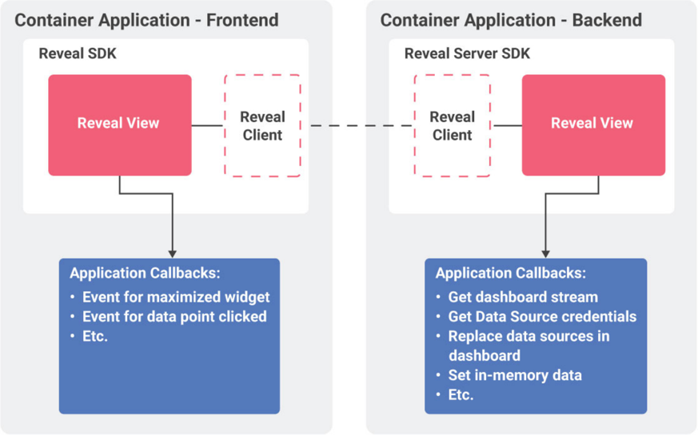

## Overview

When embedding Reveal into web applications, the architecture is
slightly more complex than with native apps, as two components are
always involved:

  - **Reveal Client SDK**: a set of JavaScript libraries and CSS files
    that needs to be integrated into the web application. The frameworks
    supported today are: jQuery, Angular and React.

  - **Reveal Server SDK**: the server-side component to be integrated
    into the server application, currently this is an ASP.NET Core
    application using .NET Runtime v4.6.1 or later. In the near future a
    library using .NET Core will be released.

In the following diagram you visualize the architecture for a web
application embedding Reveal Web SDK:



As shown above, the SDK works pretty much the same way as with native
apps. The difference is that some of the callbacks are invoked in the
client side (like the event sent when a data point is clicked) and
others are invoked server side (like the callback to load the dashboard
or to provide in-memory data).

<a name='host-client-server-separate'></a>
### Hosting the Client-side and Server-Side Parts on Different Servers

You can host the client-side and the server-side parts separately i.e. on different urls.

To achieve this, set a property on the window object, as shown below:

``` js
window.IGAppBaseURL = "{back-end base url}";
```

Please, note that the **trailing slash symbol is required** in order to set the property successfully.

Set this property **prior to the** [*instantiation of the $.ig.RevealView*](setup-configuration-web.html#instantiate-web-client-sdk).

### Related content

  - [Reveal SDK Overview](sdk-overview.md)
  - [Desktop SDK Overview](sdk-overview-desktop.md)
  - [Creating Your First App (Web)](create-first-app-web.md)
  - [Using the Server SDK (Web)](server-sdk-web.md)
  - [Using the Client SDK (Web)](client-sdk-web.md)
